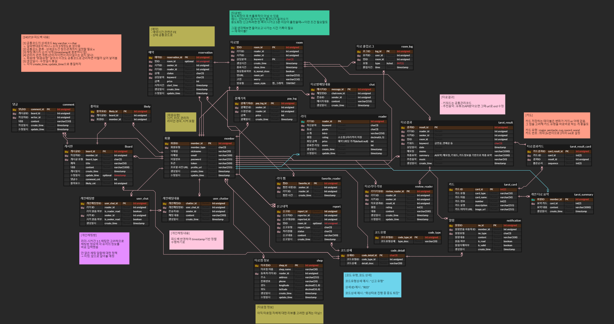
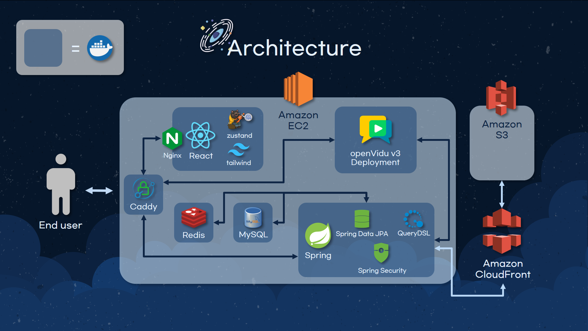
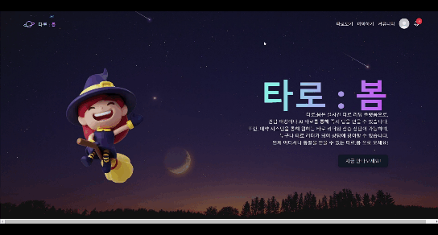

## 📚 목차

- [🗓️프로젝트 개요](#️프로젝트-개요)
  - [진행 기간](#진행-기간)
  - [기획 배경](#기획-배경)

- [💡개발 환경](#개발-환경)
  - [프로젝트 파일 구조](#프로젝트-파일-구조)

- [👯‍♀️팀 소개](#팀-소개)

- [📢서비스 소개](#서비스-소개)
  - [타로:봄](#타로봄)
  - [ERD](#erd)
  - [와이어프레임](#와이어프레임)
  - [아키텍쳐](#아키텍쳐)
  - [핵심 기술](#핵심-기술)

- [💻구현 기능](#구현-기능)

- [👍 느낀 점](#-느낀-점)


<hr>

## 🗓️프로젝트 개요

### 진행 기간
2024.07.02 ~ 2024.08.16(7주)

### 기획 배경
- 타로를 봐보고 싶지만 가볍게 시작해보기는 생각보다 어렵다.
- 사람 대 사람 타로 넘어가는 부분이 특히 어려움. 사람 대 사람 타로는 비싼 돈을 내야하는 전문가에 의한 타로가 대부분이기 때문. 또, 타로를 직접 보고자 하더라도 같은 관심사를 가진 사람을 만나기가 어렵다.
- 이런 타로의 단계별 진입장벽을 자연스럽게 해결할 수 있는 서비스를 만들자! 우리의 목표는 타로의 대중화! 하고 기획하게 된 것이 타로봄!

##  💡개발 환경

#### Backend
- SpringBoot
- Spring Data JPA
- Spring Security
- QueryDSL

#### Frontend
- React
- Node.js
- Tailwind CSS
- Zustand

#### Database
- MySQL
- Redis

#### Infra
- Docker
- Caddy
- Nginx
- Let's Encrypt(HTTPS)
- AWS EC2
- AWS S3

#### 협업 툴
- GitLab
- Jira
- Notion

#### 프로젝트 파일 구조


#### Frontend
```
📦src
 ┣ 📂API
 ┣ 📂assets
 ┃ ┣ 📂css
 ┃ ┣ 📂img
 ┃ ┣ 📂quotes
 ┃ ┣ 📂tarot_images - 복사본
 ┣ 📂components
 ┃ ┣ 📂Booking
 ┃ ┣ 📂Cards
 ┃ ┣ 📂Common
 ┃ ┣ 📂Community
 ┃ ┣ 📂Home
 ┃ ┣ 📂login_signup
 ┃ ┣ 📂Matching
 ┃ ┣ 📂Mypage
 ┃ ┣ 📂OfflineTarot
 ┃ ┣ 📂PlayTarot
 ┃ ┣ 📂ReaderProfile
 ┃ ┣ 📂SearchReader
 ┃ ┣ 📂TarotResult
 ┃ ┣ 📂WebRTC
 ┣ 📂pages
 ┃ ┣ 📂Admin
 ┃ ┣ 📂Booking
 ┃ ┣ 📂Community
 ┃ ┣ 📂CreateReader
 ┃ ┣ 📂Matching
 ┃ ┣ 📂PlayTarot
 ┃ ┣ 📂SearchReader
 ┃ ┣ 📂TarotResult
 ┃ ┣ 📂Test
 ┃ ┣ 📂UserAuth
 ┃ ┣ 📂UserProfile
 ┃ ┣ 📂WebRTC
 ┣ 📂stores
 ┣ 📂types 
 ```

## 👯‍♀️팀 소개


<br></br>

## 📢서비스 소개

### 타로:봄

- 타로:봄 – 타로점을 보고싶은 사람, 시커(seeker)와 타로점을 봐 주는 사람, 리더(reader) 모두가 쉽게 타로를 즐길 수 있는 통합 타로 플랫폼
- 시커는? -> 랜덤매칭을 통해 가벼운 타로점 보기 가능, 예약을 통해 원하는 사람과 타로를 보는 것도 가능.
- 리더는? -> 누구나 리더 프로필 생성을 통해 리더가 될 수 있음, 랜덤매칭을 통해 가볍게 타로점 봐 주기 가능,예약을 받아 약속된 때에 리딩을 하는 것도 가능.
- 커뮤니티를 통해 교류 가능,  오프라인 타로점까지의 연결

### ERD


### 와이어프레임


### 아키텍쳐


### 핵심 기술

- 이메일 인증
- WebRTC Platform openVidu v3


## 💻구현 기능
<table>
  <thead>
    <tr>
      <th>회원가입/로그인</th>
      <th>메인 페이지</th>
    </tr>
  </thead>
  <tbody>
    <tr>
      <td></td>
      <td></td>
    </tr>
  </tbody>
  <thead>
    <tr>
      <th>시커 마이페이지 & 리더 생성</th>
      <th>리더 마이페이지</th>
    </tr>
  </thead>
  <tbody>
    <tr>
      <td></td>
      <td></td>
    </tr>
  </tbody>
  <thead>
    <tr>
      <th>리더 마이페이지</th>
      <th>리더 검색 & 리더 프로필</th>
    </tr>
  </thead>
  <tbody>
    <tr>
      <td></td>
      <td></td>
    </tr>
  </tbody>
  <thead>
    <tr>
      <th>타로 방식 선택</th>
      <th>예약하기</th>
    </tr>
  </thead>
  <tbody>
    <tr>
      <td></td>
<td></td>
    </tr>
  </tbody>
  <thead>
    <tr>
      <th>AI타로</th>
      <th>타로보기/그래픽</th>
    </tr>
  </thead>
  <tbody>
    <tr>
      <td></td>
      <td></td>
    </tr>
  </tbody>
  <thead>
    <tr>
      <th>타로보기/캠</th>
      <th>커뮤니티</th>
    </tr>
  </thead>
  <tbody>
    <tr>
      <td></td>
      <td></td>
    </tr>
  </tbody>
</table>


## 👍느낀 점
